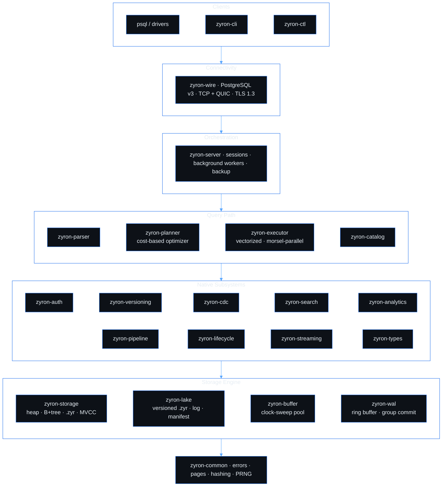
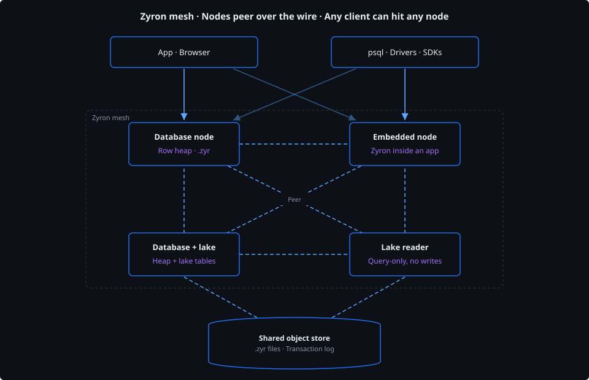
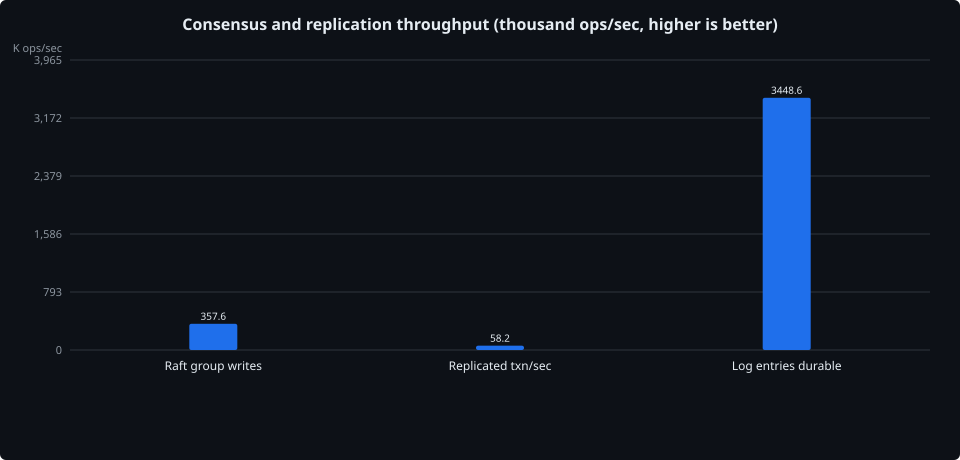
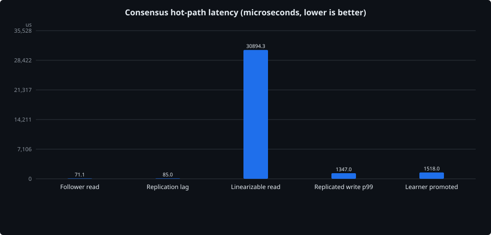

<div align="center">

<picture>
  <source media="(prefers-color-scheme: dark)" srcset="assets/brand/zyronBannerCobalt.svg">
  <source media="(prefers-color-scheme: light)" srcset="assets/brand/zyronBannerLightCobalt.svg">
  
</picture>

**A unified data platform - HTAP database, shared-storage lake, and federated mesh in one runtime, reachable from any client language.**

MVCC concurrency · lock-free hot paths · shared-storage table format · full-mesh federation · time travel · branching · CDC · native search · in-database ML · enterprise security

</div>

---

Zyron runs three surfaces off one codebase: an **HTAP database** with an MVCC row heap and a custom `.zyr` columnar format, **ZyronLake** as a shared-storage table format on an append-only transaction log with branches, time travel, and secondary indexes, and a **mesh** where any node can host a database, a lake, both, or embed in an application, and nodes peer over the wire so a single query reaches across them. All three are reachable from any client language over the same wire protocol.

Under the hood, Rust throughout, with an in-repo write-ahead log, buffer pool, B+ tree, MVCC engine, SQL parser, cost-based optimizer, vectorized executor, columnar encoding engine, lake transaction log, and wire protocol: no embedded SQL engine, no third-party storage layer, no ORM.

Fresh writes land in the MVCC row heap tuned for OLTP. A background thread compacts committed rows into `.zyr` segments with per-column encoding, and analytical queries run directly on the encoded data with predicate pushdown and late materialization. Heap and lake tables are first-class in the same SQL, joined by the same HybridScan operator, whether they live on the local node or across the mesh.

> **Status:** active development. The single-node engine is feature-complete through data lifecycle management, the ZyronLake table format runs beside it with cross-format federation, Raft consensus with logical DML replication commits writes across a three-node group under one fsync per quorum ack, and a format + signature agility substrate carries a versioned envelope on every persistent file and drives automatic migration and rolling upgrade across a Raft group. Next up is sharding, multi-region, and the enterprise stack around them.

## Table of Contents

- [Table of Contents](#table-of-contents)
- [Highlights](#highlights)
- [Architecture](#architecture)
  - [Mesh topology](#mesh-topology)
  - [Storage tiers](#storage-tiers)
- [Capabilities](#capabilities)
- [Performance](#performance)
  - [End-to-end](#end-to-end)
  - [Engine internals](#engine-internals)
  - [Row heap vs ZyronLake](#row-heap-vs-zyronlake)
- [Getting Started](#getting-started)
  - [Download](#download)
  - [Build from source](#build-from-source)
- [SQL Highlights](#sql-highlights)
- [Project Layout](#project-layout)
- [Roadmap](#roadmap)
- [Development](#development)
- [License](#license)

## Highlights

- **One engine, both workloads.** Row heap for transactional writes, `.zyr` columnar format for analytical scans, with automatic background compaction between them.
- **Mesh, not monolith.** A Zyron node can host a database, a ZyronLake, both, or neither (embedded in an app). Nodes peer over the wire and a single `SELECT` reaches across the mesh, joining a local heap table to a remote publication or a shared lake with no external gateway or middleware in front. Database nodes can also join a Raft group where writes commit through quorum and any node serves linearizable reads.
- **Quorum-committed writes.** Every DML shape, DDL, savepoints, MERGE/CALL/DO, and prepared statements over the extended protocol all ride the same replication channel. The leader group-commits under one fsync per quorum ack, followers apply committed entries through the same operator path the leader used, and follower reads take a ReadIndex round trip so they stay linearizable.
- **Shared-storage table format.** ZyronLake stores immutable `.zyr` files against an append-only transaction log versioned per commit, with `File::create_new` as the optimistic-concurrency primitive and periodic manifest checkpoints so readers open one file instead of replaying history. Branches, time travel, secondary indexes, Z-order clustering, constraint enforcement, and change feed all live in the format.
- **Lock-free hot paths.** LSN assignment, the WAL ring buffer, MVCC visibility checks, the buffer pool, and the B+ tree avoid mutexes on the query and write path entirely. Locks exist only on single-owner background threads.
- **Full durability, no per-page fsync tax.** Every commit fsyncs the WAL through group commit before acknowledging the client. Dirty heap and index pages are written by a background writer and then fsynced at explicit durability barriers, so an acknowledged transaction survives a power loss without paying a per-page fsync on the OLTP hot path.
- **Query-on-encoded.** Dictionary, RLE, bit-pack, and FastLanes columns are filtered without being decoded, and only rows that survive predicates are materialized.
- **Time as a first-class dimension.** `AS OF TIMESTAMP` and `VERSION AS OF` queries, copy-on-write branches, slowly changing dimensions, and bitemporal tables are part of the engine, with picosecond-resolution timestamps and hybrid logical clocks underneath.
- **Security built into the planner.** Three-state privileges, row-level security, column masking, ABAC, and mandatory access control are evaluated inside query planning, not in an application tier.
- **Drop-in client compatibility.** Implements the PostgreSQL wire protocol v3 over both TCP and QUIC, so existing drivers and tooling connect unchanged.
- **Format and signature agility.** Every persistent file carries a versioned envelope, every signed artifact declares its scheme, and every reader dispatches on both. Upgrades ship a migration function per format, catalog rows migrate through a schema evolution registry, user SQL objects rewrite through an AST transformer, and a health-baselined rolling upgrade lands new binaries across a Raft group with automatic rollback. Retired readers are refused by CI past their retirement date so old code never lingers.

## Architecture

Zyron is a Cargo workspace. Each crate owns one layer and depends only on the layers beneath it.



### Mesh topology

The diagram above is one node's internals. In a deployment, Zyron nodes peer over the wire. Each node can host a database only, a lake reader only, both, or be embedded inside an application. Any client can hit any node, and a single query reaches across the mesh. Lake-holding nodes share the same object-store backing. Database nodes can also be joined into a Raft group where writes commit through quorum and any node serves linearizable reads.



### Storage tiers

| Tier | Backing | Purpose |
| ------ | --------- | --------- |
| B+ tree index | Resident in RAM, persisted via WAL + checkpoint | Point lookups, range scans |
| Row heap (OLTP) | Buffer pool with clock-sweep eviction | Recent and transactional rows |
| Columnar (`.zyr`) | Disk, hot segments cached in the buffer pool | Encoded analytical scans |
| ZyronLake (`.zyr` + log) | Object store or shared filesystem, versioned per commit, manifest-checkpointed | Analytical tables on shared storage, branches, time travel, cross-engine reads |
| Write-ahead log | Append-only, group commit, fsync on commit | Durability and crash recovery |
| Raft log | Group-committed on the leader, quorum-replicated to followers, byte-aware residency cap with older entries paged from disk | Consensus record of DML and DDL for replication and failover |

## Capabilities

<table>
<tr><td valign="top" width="33%">

**Engine & SQL**

- MVCC, snapshot isolation, savepoints
- Lock-free WAL, group commit, crash recovery
- Unconditional durability: WAL fsync on every commit, background page writes with explicit fsync barriers
- `.zyr` columnar format, query-on-encoded
- HybridScan over row heap + `.zyr` segments in one operator
- Bloom filters and zone maps on segment metadata
- Cost-based optimizer: DP join reorder, predicate/projection pushdown, subquery decorrelation
- Vectorized, morsel-parallel execution
- CTEs, window functions, `MERGE`, `QUALIFY`, `ROLLUP`/`CUBE`/`GROUPING SETS`
- Time-series `GAP FILL` operator
- Prepared statements, cursors, `COPY`
- Wire protocol over TCP and QUIC

**Versioning & change**

- `AS OF TIMESTAMP` / `VERSION AS OF`
- Copy-on-write branches with merge conflict resolution
- SCD types, system/application/bitemporal time
- Picosecond-resolution timestamps with hybrid logical clocks
- Arrow `ps`->`ns` export for downstream tooling
- Diff and patch between versions
- CDC: change feeds, replication slots, Debezium / Avro / Wal2Json / native decoders, publications, snapshots

</td><td valign="top" width="33%">

**Security & governance**

- Three-state privileges (GRANT / DENY / unset) where DENY always wins and column-level overrides table-level
- Temporal grants with recurring time windows
- Row-level security and row ownership
- Attribute-based access control (ABAC)
- Mandatory access control and security labels
- Column data masking (email, phone, SSN, card, hash, partial, custom)
- Data classification with clearance enforcement
- Memory-hard password KDF, API keys, JWT, TOTP, WebAuthn, OAuth2
- AWS STS / Secrets Manager and Kubernetes auth
- Break-glass emergency access with audit trail
- Two-person rule for sensitive DDL
- Privilege analytics, delegation lineage, cascade revoke
- Brute-force throttling, session binding (IP lock, query limits)

</td><td valign="top" width="33%">

**Search & analytics**

- Full-text: inverted index, BM25, highlighting, synonyms, autocomplete
- Vector search: HNSW / IVF with self-tuning
- Graph indexing and traversal
- Cohort, funnel, period-over-period
- Single-pass profiler, outlier (IQR / MAD / Z-score), correlation (Pearson / Spearman / Kendall)
- In-database training: linear, logistic, trees, random forest, GBM, k-means, KNN
- Forecasting (ARIMA, Holt-Winters, FFT-ACF), causal inference
- Feature store with point-in-time-correct joins and lineage

**Pipelines & lifecycle**

- Declarative pipelines, triggers, UDFs, stored procedures
- Materialized views with refresh strategies, SLAs, advisor
- Data quality checks and drift detection
- Retention / TTL, tiered storage, archival
- WORM and time-bounded retention locks (immutable to admins)
- Soft delete, recycle bin, `UNDROP`
- GDPR erasure, DSAR export, legal hold, crypto-shred
- `compliance_profile` presets (GDPR / HIPAA / SOX)
- Data-residency enforcement on tier moves
- `DRY RUN` previews for archive / erasure / retention
- Lock-free cleanup governor (rate + time-window)
- Tamper-evident audit chain

</td></tr>
<tr><td valign="top" width="33%">

**ZyronLake table format**

- Immutable `.zyr` data files against an append-only transaction log, one numbered version file per commit
- `File::create_new` as the optimistic-concurrency primitive, with periodic manifest checkpoints collapsing the log
- Copy-on-write branches with merge
- Time travel to any committed version
- Secondary indexes (also versioned as lake artifacts, safe against staleness)
- Bloom filters, zone maps, and a struct-of-arrays prune index (94-100% file skip rates in practice)
- Z-order and Hilbert space-filling-curve clustering with background maintenance
- Unique and foreign-key constraint enforcement with a clustered fast path
- Change feed between two versions
- `OPTIMIZE`, `VACUUM`, `FOLLOW`, `REPAIR` operations
- Runs on local disk, shared filesystem, or object storage

</td><td valign="top" width="33%">

**Federation & mesh**

- Zyron nodes peer over the wire and address each other's data directly
- One node can host a database, a ZyronLake, both, or run embedded in an application
- Publications and subscriptions between instances with exactly-once wire-level push
- Foreign scans across the mesh: a single query can join local heap tables to remote publications or to a shared lake
- HybridScan bridges row heap and `.zyr` segments (local or remote) in one operator
- Cross-format federation: heap and lake tables are first-class in the same SQL, no separate query layer
- Dynamic REST / WebSocket / SSE endpoints (`CREATE ENDPOINT`) surface SQL directly to browsers and apps
- OAuth 2.0, AWS IAM STS, Kubernetes SA tokens, Vault / AWS Secrets Manager / GCP Secret Manager / Azure Key Vault for remote credentials
- Connection routing over host lists with role hints, DNS SRV, health checks, and automatic failover
- mTLS with SPKI pinning and labeled Prometheus families per subscriber, publication, and TLS direction

</td><td valign="top" width="33%">

**Consensus & replication**

- Raft group per cluster with leaders, followers, learners, and single-command membership change
- Group commit under one fsync per quorum ack
- Logical DML replication, heap follows row-level puts and deletes, lake follows agreed version numbers
- No primary key required. Falls back to secondary index probe or full-image match, following `REPLICA IDENTITY FULL` semantics
- DDL runs on the connection so clients see the real command tag, and the applier picks it up if the client drops
- Explicit `BEGIN` blocks, savepoints, `MERGE`/`CALL`/`DO`, and prepared statements over the extended protocol all replicate
- Savepoints resolved at capture time so rolled-back rows never ship
- Linearizable follower reads through ReadIndex
- WAL commit record carries the raft index so recovery reconciles local durability with the agreed log
- Byte-aware log residency cap with older entries paged from disk on demand
- Whole-cluster snapshots with byte-aware compaction bounded by the slowest group member
- Background writers stand down inside a group so only the replicated log commits data

</td></tr>
<tr><td valign="top" colspan="3">

**Format agility, signature agility, and auto-upgrade**

- Versioned envelope on every persistent file, 28 registered format kinds covering WAL, heap, B+tree, `.zyr`, lake manifest, lake indexes, delete predicates, raft log, snapshot transfer, replication apply log, backup archive, `zyron.toml`, secret store, audit hash chain, statistics files, MVCC CLOG, and more
- Three framings for the same identity, a 20-byte header for standalone files, a 9-byte stamp for records inside a container, and a `[format]` TOML section for hand-editable files
- Per-format migration policy (`eager`, `lazy`, `coexist`) with steady-state overhead of a single integer compare on file open
- Reader window carries the current version plus two older readers, with CI failing the build on reader code past its registered retirement date
- Signature agility for JWTs, X.509 certificates, and custom binary artifacts with per-artifact-kind current and deprecating schemes and an overlap window
- Six signature schemes registered today (Ed25519, ES256, RS256 and family), infrastructure ready for post-quantum additions without wire or code churn
- Catalog schema evolution registry across 33 tables with per-row migration functions run in-transaction at upgrade time
- AST-based user-object rewriter for views, procedures, functions, materialized views, workflows, dashboards, prompts, and data quality rules, with safe, ambiguous, and unsafe categories
- Per-tenant rewrite policy (`auto_safe`, `notify_all`, `manual_only`) and `EXPLAIN REWRITE FOR OBJECT` dry-run
- Deprecation lifecycle (`deprecated` → `warn` → `error` → `removed`) with time-bounded windows, per-tenant rate-limited warnings, and auto-generated migration guides
- Auto-upgrade orchestrator with `stable`, `beta`, `canary`, and `pinned` channels, a signed release manifest, a compatibility gate that plans chained upgrades, rolling upgrade over Raft with drain coordination, health-baselined per-node rollback with cluster-wide auto-pause, and configurable maintenance windows
- Federation-aware compatibility gate blocks upgrades that would leave a peer cluster on an incompatible version
- `zyron-ctl format`, `upgrade`, `deprecation`, and `release` subcommands for inspection, batch migration, admin trigger, and CI release verification

</td></tr>
</table>

## Performance

Two views: what a client actually gets from a running server, and the raw subsystem numbers underneath it. Every figure is extracted from the committed result files in [`benchmarks/`](benchmarks/), and the tables and charts are regenerated from them by [`scripts/gen_bench_charts.py`](scripts/gen_bench_charts.py).

<!-- BENCH:START -->
_Release build, single machine: Intel(R) Core(TM) Ultra 7 270K Plus, 24 cores, 31.4 GB RAM, windows/x86_64. Regenerated from `benchmarks/` by `scripts/gen_bench_charts.py`._

### End-to-end

What a client sees from a running server over the wire protocol, from cold start to shutdown:

| Lifecycle / workload | Result |
|----------------------|--------|
| Cold boot to accepting queries | 34 ms |
| First `ReadyForQuery` | 0.54 ms |
| Schema DDL bootstrap | 7.7 ms |
| Seed insert | 238K rows/sec |
| OLTP, 1 client | 13.4K tps, p99 240 us |
| OLTP, 4 clients | 38.4K tps, p99 293 us |
| OLTP, 16 clients | 66.4K tps, p99 480 us |
| OLTP, 64 clients | 62.3K tps, p99 1731 us |
| OLTP, 256 clients | 56.6K tps, p99 8094 us |
| Analytical query (median) | 0.59 ms |
| Graceful shutdown | 62 ms |


### Engine internals

Raw subsystem throughput and hot-path latency under microbenchmark:


### Row heap vs ZyronLake

Same workload, same rows, run against both formats. Blue is Row heap and purple is ZyronLake, and the shorter bar wins on wall-clock. Write-heavy trade-offs where the Row heap wins (bulk load, trickle load, indexed point lookup) are in the table below so the picture is honest, not cherry-picked.


### Consensus and replication

A three-node Raft group with the leader accepting writes, followers applying committed entries through the same operator path the leader used, and reads served through a ReadIndex round trip so they stay linearizable. Throughput first, then hot-path latency:





A few more numbers not shown in the charts above:

| Subsystem | Metric | Result |
|-----------|--------|--------|
| MVCC | GC sweep | ~1.8B tuples/sec |
| Columnar | .zyr scan throughput | ~12.4 GB/sec |
| Columnar | Compaction pipeline | ~12.3M rows/sec |
| Columnar | HybridScan overhead vs heap-only | ~1.4% |
| Columnar | Metadata-aggregate pruning speedup | ~50.1x |
| Temporal | Picosecond timestamp decode | ~966M rows/sec |
| Versioning | Time-travel scan overhead | ~24% |
| Wire | QUIC PostgreSQL handshake | ~5 us |
| Transactions | Durable commit floor (device write) | ~81.2 us |
| Lake | Commit rate (insert) | ~2389 commits/sec |
| Lake | Commit latency (insert) | ~2.39 ms |
| Lake | Commit rate (delete predicate) | ~2043 commits/sec |
| Lake | Derived clustering expression files pruned | ~93% |
| Lake | Load with clustering expression | ~752K rows/sec |
| Consensus | Leader election after a kill | ~233 ms |
| Consensus | Single log append | ~0.20 us |
| Consensus | Snapshot 1GB, create | ~0.93 s |
| Consensus | Snapshot 1GB, transfer | ~2.66 s |
| Replication | Follower keep-up vs leader | ~99.8% |
| Replication | Worst follower lag | ~113 entries |
| Transactions | Durable group-commit peak | ~776K txn/sec |
| Transactions | Group-commit amplification (c=1 to c=512) | ~77.7x |
| Cross-format | Point lookup with a heap B+tree index, lake vs heap | ~0.8x (heap wins indexed points) |
| Cross-format | Bulk load to queryable, lake vs heap | ~1.4x (heap wins large batches) |
| Cross-format | Trickle load to queryable, lake vs heap | ~10.0x (heap wins tiny commits) |

45 benchmark suites cover storage, executor, optimizer, encoding, wire, search, analytics, CDC, versioning, transactions, temporal, columnar, lake, cross-format, raft, replication, types, lifecycle, gateway, Zyron-to-Zyron, and end-to-end. Each run writes a timestamped JSON/TXT pair under `benchmarks/<suite>/`.
<!-- BENCH:END -->

## Getting Started

### Download

Prebuilt binaries for Linux x86_64 and Windows x86_64 are attached to every
[release](https://github.com/DataDalton/Zyron/releases). Each archive contains
`zyron-server`, `zyron-cli`, and `zyron-ctl`.

```bash
tar xzf zyron-<version>-x86_64-unknown-linux-gnu.tar.gz
cd zyron-<version>-x86_64-unknown-linux-gnu
./zyron-server --version
./zyron-server --data-dir ./data
```

Checksums are published as `SHA256SUMS.txt` on the release page.

### Build from source

**Prerequisites.** The Rust nightly toolchain pinned in `rust-toolchain.toml` (`rustup` selects it automatically) and a C toolchain for the TLS dependency.

```bash
# Build
cargo build --release

# Run the server
cargo zyron -- --data-dir ./data --port 5432
#   alias for: cargo run --release --bin zyron-server --

# Connect with the bundled client
cargo cli -- --host localhost --port 5432

# Or any PostgreSQL client
psql -h localhost -p 5432 -U postgres

# Administer
cargo run --release --bin zyron-ctl -- status
cargo run --release --bin zyron-ctl -- backup --out ./backup
```

Server flags include `--config`, `--host`, `--log-level`, `--foreground`, `--single-user`, and `--skip-recovery`.

## SQL Highlights

Standard SQL, plus native extensions that go beyond it:

```sql
-- Read a table as it was at a point in time
SELECT * FROM orders AS OF TIMESTAMP '2026-05-06 09:00:00';

-- Branch the database, experiment in isolation, then merge or drop
CREATE BRANCH experiment FROM main;
USE BRANCH experiment;

-- Native vector search
CREATE VECTOR INDEX ON docs (embedding) WITH (metric = 'cosine');
SELECT id FROM docs ORDER BY embedding <=> $1 LIMIT 10;

-- BM25-scored full-text search
CREATE FULLTEXT INDEX ON articles (body);
SELECT id FROM articles
WHERE MATCH(body) AGAINST ('rust database' IN NATURAL LANGUAGE MODE);

-- Feature store and in-database model training
CREATE FEATURE GROUP customer_features AS SELECT ... ;
CREATE MODEL churn AS TRAIN logistic ON customer_features;

-- Security expressed in DDL
ALTER TABLE patients ADD MASKING POLICY ssn USING mask_ssn();
GRANT SELECT ON revenue TO analyst VALID FROM '2026-01-01' UNTIL '2026-12-31';

-- Lifecycle governance
ALTER TABLE events SET TTL '90 days';
ARCHIVE TABLE old_events WHERE created < '2024-01-01' TO 's3://archive/events';
```

## Project Layout

<details>
<summary><b>Workspace crates and binaries</b></summary>

```
crates/
  zyron-common        errors, page constants, FX hash, PRNG, config
  zyron-wal           ring-buffer WAL, LSN sequencer, group commit, recovery
  zyron-buffer        clock-sweep buffer pool, background writer
  zyron-storage       heap, B+ tree, .zyr columnar, encoding, MVCC txn module
  zyron-catalog       databases/schemas/tables/indexes, stats, WAL-logged DDL
  zyron-parser        recursive descent + Pratt SQL parser, typed AST
  zyron-planner       binder, logical/physical plans, cost model, optimizer
  zyron-executor      vectorized, morsel-parallel operators
  zyron-wire          PostgreSQL v3 over TCP + QUIC, COPY, auth, pooling
  zyron-server        orchestration, sessions, background workers, backup
  zyron-auth          RBAC/ABAC, masking, RLS, governance, external auth
  zyron-versioning    time travel, branching, SCD, bitemporal, diff/patch
  zyron-cdc           change feeds, replication slots, logical decoders
  zyron-pipeline      pipelines, triggers, UDFs, materialized views, SLAs
  zyron-search        full-text (BM25), vector (HNSW/IVF), graph
  zyron-analytics     grouping, cohort, funnel, profiling, forecasting, ML
  zyron-types         native data types and operations
  zyron-lifecycle     retention, tiered storage, archival, GDPR, audit chain
  zyron-streaming     windowing, exactly-once, stream joins, backpressure
  zyron-bench-harness shared benchmark harness and result output

binaries/
  zyron-server      database server entry point
  zyron-cli         psql-like interactive client
  zyron-ctl         admin tool: status, backup, restore, vacuum, compact

benchmarks/           timestamped JSON/TXT results, one folder per suite
scripts/              tooling, including the benchmark chart generator
```

</details>

## Roadmap

Each area ships with an optimization review and a validation checkpoint with hard performance budgets before the next begins.

| Area | Scope | State |
| ------ | ------- | ------- |
| Storage foundation | WAL, buffer pool, heap, B+ tree, MVCC, encoding engine, parser, catalog, planner, executor, wire, server | ✅ Complete |
| Security & optimization | Authentication, RBAC/ABAC, row/column security, cost model, configuration | ✅ Complete |
| Data operations | Versioning & time travel, CDC, pipelines/triggers/UDFs, streaming, server integration | ✅ Complete |
| Native features | Full-text search, vector & graph search, native data types, utility operations | ✅ Complete |
| Analytics & lifecycle | Analytics engine, feature store & ML, data lifecycle management | ✅ Complete |
| ZyronLake table format | Immutable versioned `.zyr` on a transaction log, branches, time travel, secondary indexes, clustering, constraint enforcement, change feed, cross-format federation | ✅ Complete |
| Consensus and replication | Raft groups per cluster, quorum-committed writes with one fsync per ack, logical DML replication for heap and version replication for lake, linearizable follower reads through ReadIndex, learner promotion, whole-cluster snapshots | ✅ Complete |
| SQL surface, type system and media types | Range and multirange types, interval refinements, native media types, additional function coverage, and a silent-bug hardening pass across the engine | ✅ Complete |
| Format agility and auto-upgrade | Versioned envelope on every persistent file, signature agility for JWTs, X.509 certs, and custom artifacts, catalog schema evolution registry, AST-based user-object rewriter, deprecation lifecycle, and a health-baselined rolling upgrade orchestrator over Raft with automatic rollback and federation-aware compat gating | ✅ Complete |
| Enterprise & distribution | Sharding and multi-region, secret store and KMS, high availability and DR, observability and compliance, semantic views, schema registry, data contracts, data governance, multi-tenancy and cost tracking, migration tools and ecosystem connectors, Volumes (arbitrary-file storage as catalog objects), enterprise type-system extensions | ⏳ Planned |
| Serverless mesh and autonomous operations | Base compute mesh, user meshes with compute reservations, workload-aware scheduling, continuous self-tuning and self-healing across every node in the mesh, query engine advances | ⏳ Planned |
| Wire protocols, API and drivers | ZWP native wire protocol alongside PostgreSQL wire compatibility, Zyron API (unified QUERY / POST / GET / WS surface for apps), native drivers across every supported client language, Zyron Embedded (`libzyron`) for in-process use | ⏳ Planned |
| Application and workflow hosting | Zyron Apps (container hosting on the mesh substrate), Workflows (task orchestration subsuming pipelines and schedules), deployment artifacts, SQL function library expansion | ⏳ Planned |
| Dashboards and workspace | Zyron Dashboards (first-party visualization with live query overlays, formatting with data, branch-native and time-travel-aware), Zyron Workspace with editors, language runtimes (Python, JS/TS, Java/Scala, Go, Rust), data & discovery, ops & integrations | ⏳ Planned |
| Enterprise identity, cross-cluster and Git | Enterprise auth (OIDC, SAML, TOTP, WebAuthn, universal PATs, tenant security policies), cross-cluster federation with mutual TLS and primary/secondary/peer roles, authorized Git integration per workspace with item versioning | ⏳ Planned |
| AI Gateway and AI-native assist | BYO-credentials gateway with prompt versioning and branching, semantic caching, continuous evaluation and cost tracking, plus opt-in per-workspace SQL, chart, and notebook assist that routes through the gateway | ⏳ Planned |
| Zyron Web | React + Vite + Tailwind webapp shipping as a first-party static Zyron App, path-based URLs, admin surfaces for every backend area above | ⏳ Planned |

## Development

```bash
# Per-crate tests
cargo test -p zyron-storage

# Whole workspace
cargo test --workspace

# A benchmark suite, release build and serialized, results land in benchmarks/<suite>/
cargo test -p zyron-search --test search_bench --release -- --nocapture

# Regenerate the README performance charts from the latest benchmark files
python scripts/gen_bench_charts.py

# Lint and format
cargo fmt --check
cargo clippy --workspace -- -D warnings
```

## License

Copyright (c) 2026 Zyron LLC. **All rights reserved.** Zyron is proprietary software. Personal use is free, commercial use requires a license. See [LICENSE](LICENSE.md) for the full terms.

Zyron LLC · Licensing inquiries: [licensing@zyrondb.com](mailto:licensing@zyrondb.com)
